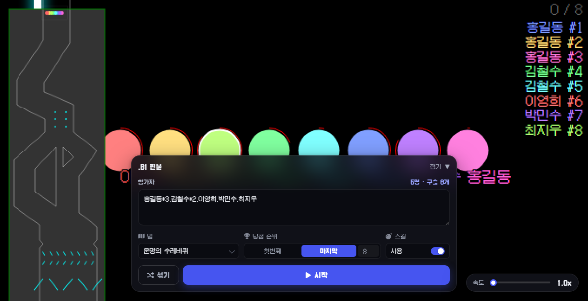
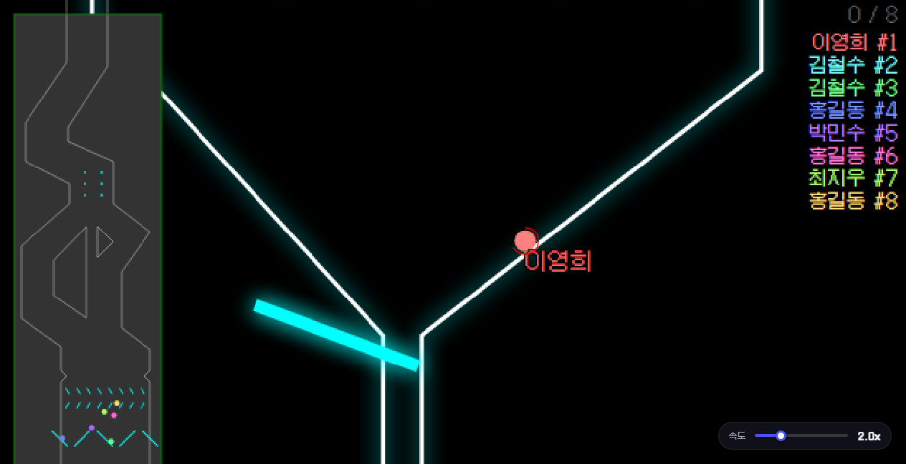

<div align="center">

# 🎱 .B1 핀볼

**이름을 넣고 구슬을 굴려 순위를 정하는 추첨기**

방송에서 시청자 추첨, 팀 나누기, 벌칙 뽑기 —<br/>
구슬이 끝까지 굴러가야 결과가 나오니까 보는 재미가 있다.

<br/>

[](https://b1-pinball.vercel.app)


<br/>



</div>

<br/>

## 이렇게 쓴다

이름을 넣고 **시작**을 누르면 구슬이 트랙을 굴러 내려간다.
먼저 도착한 순서대로 순위가 매겨지고, 정해둔 순위에 들어온 구슬이 당첨이다.

| 입력 | 뜻 |
| --- | --- |
| `홍길동` | 구슬 1개 |
| `홍길동*3` | 구슬 3개 — 당첨 확률 3배 |
| `홍길동, 김철수` | 쉼표나 줄바꿈으로 구분 |

입력칸 밖을 클릭하면 중복된 이름이 `이름*n` 으로 알아서 합쳐진다.
<kbd>Ctrl</kbd> + <kbd>Enter</kbd> 로 바로 시작할 수도 있다.

<br/>

## 뭐가 되나

- **맵 4종** — 운명의 수레바퀴 / 버블팝 / 욕망의 항아리 / 밤을 달리다
- **당첨 순위 지정** — 첫번째, 마지막, 혹은 원하는 등수 직접 입력 (기본값: 마지막)
- **스킬** — 경주 중 구슬이 서로를 방해하는 이벤트. 끄면 순수 물리 싸움
- **속도 조절** — 1.0x ~ 5.0x, 경주 중에도 조절 가능
- **픽셀 폰트** — 갈무리11 (한글 지원 도트 폰트) + 캔버스 도트 확대
- 참가자 수와 구슬 개수를 실시간으로 보여준다
- 경주가 시작되면 패널이 사라지고, 끝나면 3초 뒤 돌아온다

<div align="center">

</div>

<br/>

## 구조

```
index.html               페이지 뼈대 + importmap + 조작 패널 마크업
assets/
  ui.css                 화면 UI 전부 — 색·간격 토큰이 맨 위에 모여 있다
  app.js                 조작 로직 — 입력 파싱, 버튼, 옵션, 속도, 토스트
  engine.css             게임 엔진이 쓰는 최소 스타일 (캔버스 + 아이콘)
  fonts/                 갈무리11 (SIL OFL)
  roulette.js            게임 본체 — 원본 빌드 번들 (minify 상태)
  ao29o.js · dRxiZ.js    box2d-wasm 로더 (SIMD / 일반)
  b21ls.wasm · ikqOI.wasm  물리 엔진
  *.png · *.svg          맵/구슬 텍스처
serve.js                 로컬 정적 서버 (의존성 없음)
vercel.json              배포 설정 (캐시 헤더)
tools/                   유저스크립트에서 게임 HTML 다시 뽑는 스크립트
sample.script            원본 유저스크립트 (SOOP 채팅 수집기 + 게임 내장)
docs/                    README 스크린샷
```

### 어디를 고치면 되나

| 하고 싶은 것 | 파일 |
| --- | --- |
| 색·모서리·그림자 등 전체 톤 | `assets/ui.css` 맨 위 `:root` |
| 패널 구성·문구·버튼 배치 | `index.html` `<body>` |
| 버튼 동작, 이름 파싱, 맵 이름, 단축키 | `assets/app.js` |
| 픽셀 느낌 끄기 | `assets/ui.css` 의 `canvas { image-rendering: pixelated }` 삭제 |
| 맵 추가 | `window.__marbleMaps` 배열에 맵 객체를 `push` |
| 맵·스킬·물리 등 게임 내부 | `assets/roulette.js` — 번들이라 난이도 높음 |

<br/>

## 배포

Vercel 에 올라가 있다 — <https://b1-pinball.vercel.app>

```bash
vercel deploy --prod
```

빌드 단계가 없는 정적 사이트라 파일을 그대로 올린다.
`vercel.json` 은 폰트와 wasm 에 장기 캐시 헤더만 붙이고,
`.vercelignore` 로 사이트 구동에 필요 없는 파일(원본 유저스크립트, 스크린샷 등)은 빼둔다.

<br/>

## 알아둘 점

- 화면은 다크 테마 전용이다.
- 실행 중 `marblerouletteshop.com` 으로 커스텀 구슬 스킨을 가져오려 시도한다. 실패해도(403 등) 게임은 정상 동작한다.
- 원본 빌드에 있던 Google Analytics / umami 추적 코드와 녹화 기능은 제거했다.
- 게임 원본·폰트 라이선스는 [CREDITS.md](CREDITS.md) 참고.

<br/>

<div align="center">
<sub>게임 엔진 <a href="https://github.com/lazygyu/roulette">lazygyu/roulette</a> (MIT) · 폰트 <a href="https://github.com/quiple/galmuri">갈무리</a> (SIL OFL)</sub>
</div>
